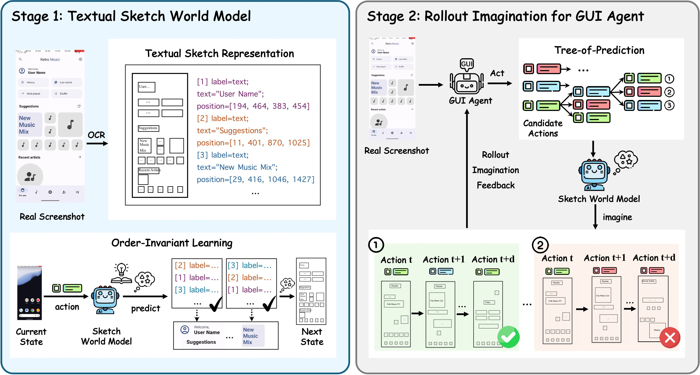
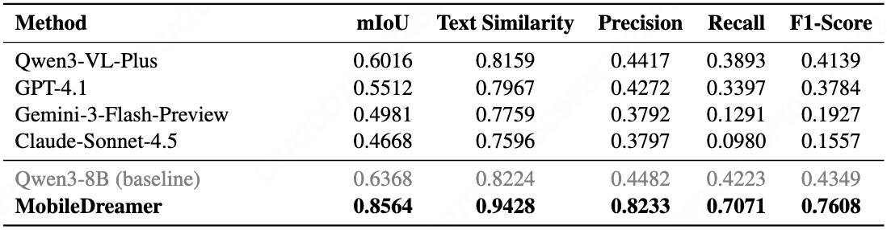
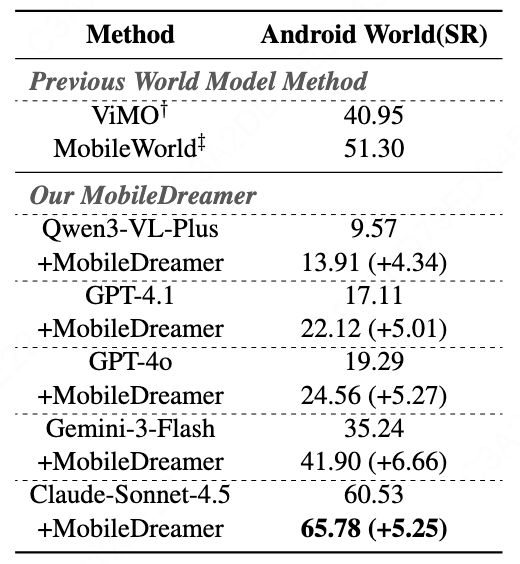

<div align="center">
  <h1>MobileDreamer: Generative Sketch World Model for GUI Agent
</h1>
</div>

<div align="center">
<a href='https://arxiv.org/abs/2601.04035'></a>&ensp;
<a href='https://huggingface.co/UITron-hub/MobileDreamer'></a>&ensp;
<a href=https://github.com/tatsu-lab/stanford_alpaca/blob/main/LICENSE></a>

Yilin Cao*, Yufeng Zhong*, Zhixiong Zeng $^{\dagger}$, Liming Zheng, Jing Huang, Haibo Qiu, Peng Shi, Wenji Mao $^{\dagger}$, Wan Guanglu

*Equal Contribution, $^{\dagger}$ Corresponding Authors
</div>

# 📢 News and Updates
* **[Jan 7, 2025]** 🎉 Evaluation code is now available!
* **[Jan 7, 2025]** 🤗 Model weights released on [Hugging Face](https://huggingface.co/UITron-hub/MobileDreamer).
* **[Jan 7, 2025]** 📄 Preprint released on [arXiv](https://arxiv.org/abs/2601.04035).

# 🤖 Pipeline

Overview of the MobileDreamer framework. In stage 1, we build a textual sketch world model to predict future states through order-invariant learning. In stage 2, we design a rollout imagination strategy that recursively feeds the tree-of-prediction back to the GUI agent to optimize the action-selection processes.

# 📊 Performance

## World Model


Evaluation of the textual sketch world model on future-state forecasting. We report geometry agreement (mIoU), text agreement (Text Similarity), and element-level matching metrics (Precision/Recall/F1-Score).

## Mobile GUI Agent


Comparison of our MobileDreamer and baselines on Android World. SR represents the task success rate. $^{\dagger}$ Results are reported from ViMo. $^{\ddagger}$ Results are reported from MobileWorld. For MobileDreamer, we use the tree-of-prediction with depth $d{=}2$ and candidate actions $M{=}3$.

# 🔍 Usage Example
1. Navigate to the `rollout_imagination_for_GUI_agent` directory
2. Modify the `run_agent.sh` file with your own configuration
3. Execute the script:
   ```bash
   bash run_agent.sh
   ```

# 📌 Acknowledgement
We sincerely appreciate [LLaMA-Factory](https://github.com/hiyouga/LLaMA-Factory) for providing reference training framework.
